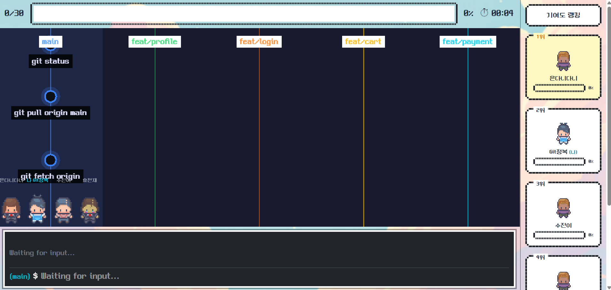
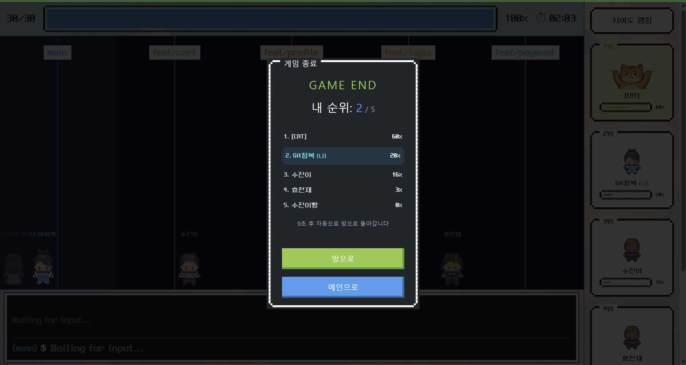
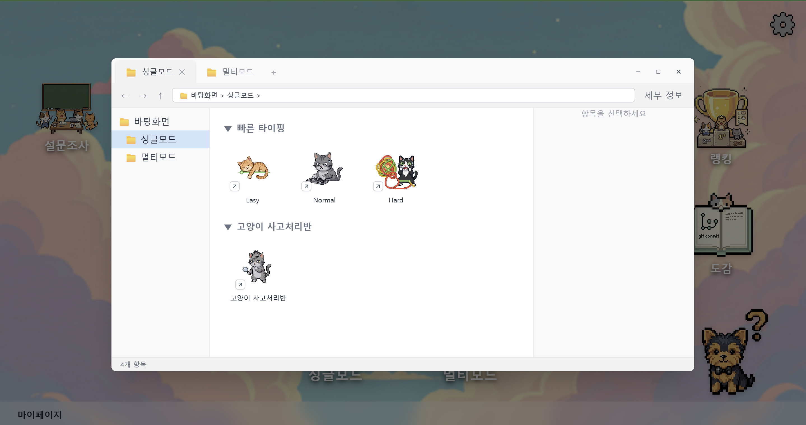
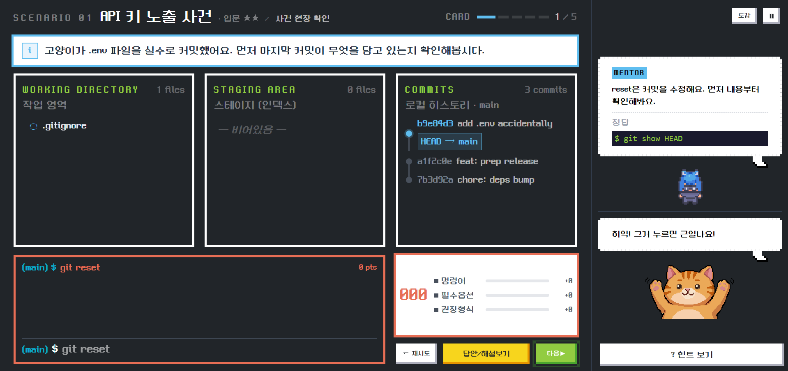

# 🎬 Let's Git it — 시연 스크립트 (발표자 대본)

---

## 🎬 오프닝

> "직접 게임하는 화면을 보여드리겠습니다."

**시연:** 4명 접속 및 방 입장 확인

> "총 4분이 모이셨네요. 지금부터 기여도 뺏기 게임을 시작하겠습니다. 화면에서 내려오는 Git 명령어를 보이는 대로 타이핑하시면 됩니다. 먼저 치는 사람이 기여도를 가져갑니다. 시작할게요."

---

## 🎮 1막 — 기여도 뺏기 게임 진행

> "게임이 시작됐습니다. 화면에서 명령어들이 내려오고 있고, 참여자분들이 타이핑하고 계시네요."

**시연:** 게임 진행 → 기여도 실시간 변화

> "게임이 끝났습니다. 참여해주신 분들 감사합니다. 결과를 보시면 플레이어마다 기여도 차이가 꽤 나는 걸 보실 수 있어요. Git 명령어에 얼마나 익숙한지가 점수에 그대로 나타납니다."

---

## 🤔 전환 — 학습의 필요성

> "시연자가 게임을 마치고 이런 생각을 합니다. '명령어를 몰라서 그런지 너무 어려웠다. 개념을 좀 더 알면 게임을 잘 할 수 있지 않을까?' 그래서 학습 모드로 넘어가 보겠습니다."

---

## 📖 2막 — 고양이사고처리반 학습

> "이게 저희 서비스의 학습 전용 모드, '고양이사고처리반'입니다."

**시연:** 고양이사고처리반 진입 → 시나리오 화면

> "단순한 명령어 나열이 아니라 시나리오 형식으로 진행됩니다. 지금은 '고양이가 .env 파일을 실수로 커밋했다'는 상황이 주어졌습니다. 이 사고를 수습하려면 어떤 Git 명령어를 써야 하는지, 직접 입력하면서 배우는 방식입니다."

**시연:** 시나리오 진행 → 명령어 입력 → 재점하기

> "명령어를 입력하면, Pro Git 공식 문서를 근거로 AI가 1~2문장으로 코칭을 바로 제공합니다. 내가 왜 틀렸는지, 어떻게 써야 하는지를 게임 흐름 안에서 자연스럽게 익힐 수 있습니다."

---

## 🏆 클로징

> "게임으로 부딪히고, Let's Git It으로 이해하는 것. 이것이 Let's Git it이 제안하는 Git 학습 방식입니다."
